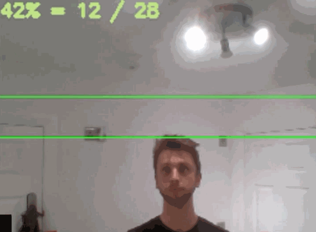
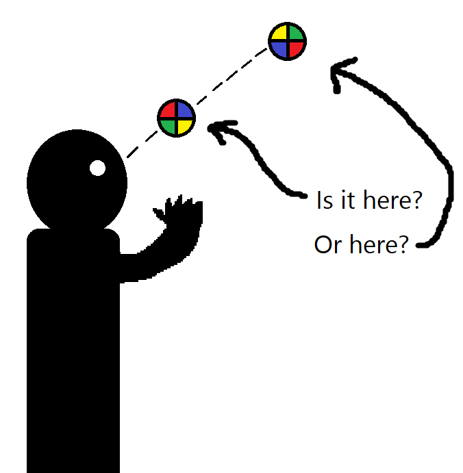

<!-- ABOUT THE PROJECT -->
## About The Project

When I started learning how to juggle, I was constantly reminded to try and throw the balls at the same height, just above my head. I had a lot of trouble telling what height I was throwing the balls at, so I wrote a program to help me improve on the height consistency.

This program uses your webcam to detect the juggling balls and mark their maximum height reached. It will then playback a sound to indicate if the ball was thrown at a correct height, letting you improve over time as you get feedback from the program.

[](https://www.youtube.com/watch?v=vroV6zRVIQU&feature=youtu.be)

Is this really a problem big enough to need a program for? Probably not, but I had trouble telling what height I was throwing the balls at when they were above my eye level (as shown in the picture below). Plus it gave me an excuse to learn a little bit more about machine learning and computer vision.


[]


### Built With

* [Python3](https://www.python.org/)
* [OpenCV](https://opencv.org/)
* [YoloV3](https://pjreddie.com/darknet/yolo/)


<!-- GETTING STARTED -->
## Getting Started

To get a local copy up and running follow these steps.

### Prerequisites

Python3 - https://docs.python-guide.org/starting/install3/win/

If you want to use your GPU to do object detection instead of your CPU, then you will need an Nvidia GPU with CUDA cores. Detecting objects with your GPU is much faster than a CPU and is likely that you'll need to do this step if you want to do the detection in real time. Not all Nvidia GPUs support CUDA, so please [check here](https://en.wikipedia.org/wiki/CUDA#GPUs_supported) if yours is listed.
Building OpenCV to include CUDA (Nvidia GPU feature) - https://www.youtube.com/watch?v=_fqpYLM6SCw


### Installation

1. Clone the repo
```sh
git clone https://github.com/worm00111/juggling-helper.git
```
2. Install pip packages
```sh
pip install -r requirements.txt
```
3. Run the program from the root directory
```sh
python src/juggling_helper.py
```

<!-- USAGE EXAMPLES -->
## Usage

There are flags available if you want to customize your juggling ball tracking or video parameters:
```sh
usage: juggling_helper.py [-h] [-s] [-d] [-t] [-r] [-f] [--reset]

Record the max height at which juggling balls are thrown

optional arguments:
  -h, --help          show this help message and exit
  -s , --scale        Resize the window size
  -d, --debug         Enable printing of FPS and draw squares around balls
  -t , --tracktime    Max time to reacquire a tracked ball
  -r , --trackrange   Max range to reacquire a tracked ball
  -f , --framerate    Framerate at which to record the output video
  --reset             Reset settings to their default parameters
```


<!-- ROADMAP -->
## Roadmap

There are a couple of areas I'd like to improve on to make this program detect objects more consistently and provide a smoother experience:
	• Detection model
		○ Doesn't detect motion blurred objects
			§ Could apply a machine learning model on every frame to reduce motion blur
				□ Might slow down detection
			§ Train model more to work better with motion blurred objects
		○ Try different training models
			§ YoloLite
				□ Faster, but could reduce detection rate
		○ My trained model would likely have trouble working outside or in a different colored room as I trained it specifically inside my room
			§ Could increase training sample size to include pictures from outside and different colored rooms
	• Sound
		○ When a sound plays, it halts the program a little bit
            § Should play the sound on a different thread so as to not halt the rest of the program


<!-- CONTACT -->
## Contact

Vilius Drumsta - vdrumsta@gmail.com

Project Link: [https://github.com/worm00111/juggling-helper](https://github.com/worm00111/juggling-helper)


<!-- ACKNOWLEDGEMENTS -->
## Acknowledgements

* [OpenCV Contrib](https://github.com/opencv/opencv_contrib) for providing extended OpenCV functionalities
* [Adrian Rosebrock](https://www.youtube.com/watch?v=H0ztMWR3C04) for making a tutorial describing the base implementation of object tracking
* [Python Simple Audio Package](https://simpleaudio.readthedocs.io/en/latest/)
